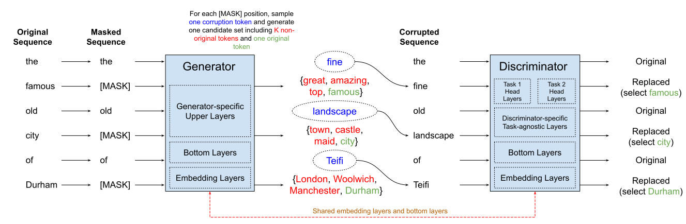

# hmTEAMS

Historic Multilingual and Monolingual [TEAMS](https://aclanthology.org/2021.findings-acl.219/) Models.
The following languages are covered:

* English (British Library Corpus - Books)
* German (Europeana Newspaper)
* French (Europeana Newspaper)
* Finnish (Europeana Newspaper, Digilib)
* Swedish (Europeana Newspaper, Digilib)
* Dutch (Delpher Corpus)
* Norwegian (NCC Corpus)

# Architecture

We pretrain a "Training ELECTRA Augmented with Multi-word Selection"
([TEAMS](https://aclanthology.org/2021.findings-acl.219/)) model:

# Pretraining

We pretrain the hmTEAMS model on a v3-32 TPU Pod. All details can be found [here](pretraining.md).

# Results

We perform experiments on various historic NER datasets, such as HIPE-2022 or ICDAR Europeana.
All results incl. hyper-parameters can be found [here](bench/README.md).

# Release

Our pretrained hmTEAMS model can be obtained from the Hugging Face Model Hub. Because of complicated
license issues (that needs to be figured out), the model is only available by requesting access from
Model Hub:

* [hmTEAMS Discriminator](https://huggingface.co/hmteams/teams-base-historic-multilingual-discriminator)
* [hmTEAMS Generator](https://huggingface.co/hmteams/teams-base-historic-multilingual-generator)

## Fine-tuned Models

We release the following models, trained on various Historic NER Datasets (HIPE-2002, ICDAR):

* [AjMC English (HIPE-2022)](https://huggingface.co/hmteams/flair-hipe-2022-ajmc-en)
* [AjMC German (HIPE-2022)](https://huggingface.co/hmteams/flair-hipe-2022-ajmc-de)
* [AjMC French (HIPE-2022)](https://huggingface.co/hmteams/flair-hipe-2022-ajmc-fr)
* [Finnish (NewsEye, HIPE-2020)](https://huggingface.co/hmteams/flair-hipe-2022-newseye-fi)
* [Swedish (NewsEye, HIPE-2020)](https://huggingface.co/hmteams/flair-hipe-2022-newseye-sv)
* [French (ICDAR-Europeana)](https://huggingface.co/hmteams/flair-icdar-fr)
* [Dutch (ICDAR-Europeana)](https://huggingface.co/hmteams/flair-icdar-nl)

# Changelog

* 27.08.2023: Evaluation on [LeTemps](https://github.com/hipe-eval/HIPE-2022-data/blob/main/documentation/README-letemps.md) dataset is added [here](bench/README.md).
* 06.08.2023: Evaluation on various historic NER datasets are completed. Results can be found [here](bench/README.md).
* 01.08.2023: hmTEAMS organization can be found on the [Model Hub](https://huggingface.co/hmteams).
              More information of how to access trained hmTEAMS models are coming soon.
* 25.05.2023: Initial version of this repo.

# Acknowledgements

We thank [Luisa März](https://github.com/LuisaMaerz), [Katharina Schmid](https://github.com/schmika) and
[Erion Çano](https://github.com/erionc) for their fruitful discussions about Historic Language Models.

Research supported with Cloud TPUs from Google's [TPU Research Cloud](https://sites.research.google/trc/about/) (TRC).
Many Thanks for providing access to the TPUs ❤️
